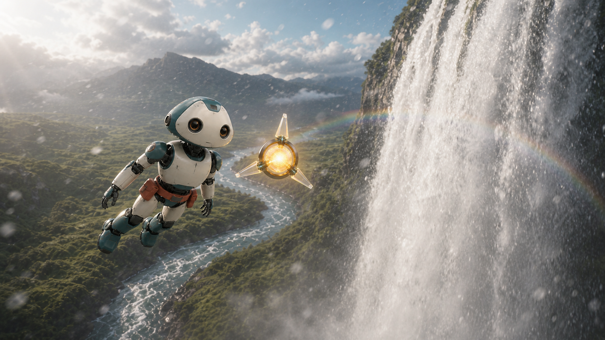

[English](README.md) | 日本語

# nijiunit-public-ai-agent-video-studio

AIエージェントと生成AIを使い、3秒単位の短い動画を、キャラクターの外見と動きをできるだけ保ちながら制作するための公開リファレンス実装です。

このリポジトリで扱う中心課題は、単なる動画生成ではなく、ショットをまたいだ一貫性です。

- 外見・禁止事項・素材の権利を記録する、版管理されたキャラクター台帳
- 通常時と固有動作を新規生成した3秒のキャラクターデザイン動画
- デザイン動画から抽出した時刻付きキーフレームと動作指示
- 直前クリップの最終フレームを次の開始フレームへ渡す連続生成
- 生成動画を9コマで確認し、音声・字幕をローカルで仕上げる工程
- エピソードごとに残すAIモデル使用記録



[▶ 完成デモ「星のむこうの虹」を開く（30秒MP4）](examples/space-friends/demo.mp4)

この公開デモでは、場面ごとの開始画像、宇宙飛行・映画的な急降下・滝横断・低空飛行・着地の専用動作、ショット別TTS、宇宙から風・川・滝・草原へ連続的に変化するローカル音響まで確認できます。構成、キャラクター台帳、AIモデル使用記録、全90コマの確認表も[examples/space-friends](examples/space-friends)にまとめています。

## 公開版に含めていないもの

このリポジトリは、既存の非公開制作リポジトリを丸ごと公開したものではありません。実在人物、家族やペット、過去作品、案件固有スクリプト、制作履歴、APIキー、生成サービスの非公開メタデータは含めません。公開用に新規作成した架空キャラクター「ミオ」と「ルクス」だけをサンプルにしています。

## AIエージェントに頼む

クローンしたリポジトリをCodexなどのAIエージェントで開き、次のように依頼できます。

```text
このアプリを使えるようにしてください。
```

AIエージェントは[AGENTS.md](AGENTS.md)に従い、専用セットアップスクリプトを実行して、仮想環境、依存関係、`.env`、FFmpeg、公開サンプルを診断します。APIキーが未設定なら、Google AI Studioでの取得、安全な非表示入力、再診断まで案内します。セットアップ中に生成APIは呼ばず、既存の`.env`も無断で上書きしません。

この依頼は、案内AIによってAIエージェントの導入、Gitの準備、リポジトリのクローン、このフォルダを開くところまで終わった後に行います。以降はこのリポジトリ側が、Python、FFmpeg、Google生成AI APIの料金・課金・APIキー・接続確認を担当します。初心者本人の操作が必要な場面では、一度に一つだけ案内します。

```text
このアプリの使い方を教えてください。
```

この依頼では[利用者向けガイド](docs/getting-started.ja.md)を参照して、インストールやAPI呼び出しをせずに使い方を説明します。

## セットアップの担当範囲

Python 3.11以降が必要です。Pythonが未導入でも、AIエージェントは[Pythonの初回準備](docs/python-setup.ja.md)に従って導入から案内します。

Windows:

```powershell
powershell -ExecutionPolicy Bypass -File scripts/setup.ps1
```

macOS / Linux:

```bash
bash scripts/setup.sh
```

手動でセットアップする場合:

```powershell
py -3 -m venv .venv
.\.venv\Scripts\python.exe -m pip install -e "."
if (-not (Test-Path .env)) { Copy-Item .env.example .env }
.\.venv\Scripts\python.exe scripts\doctor.py
```

ローカル環境の準備後は、[Google生成AI APIの初回準備](docs/google-api-setup.ja.md)に従い、AIエージェントが一操作ずつ案内します。このアプリの既定動画モデルは有料枠のため、APIキーより先に最新料金、プロジェクト、課金方式を利用者本人と確認します。

APIキーを取得した後は、キーをチャットへ貼らず、次の専用ツールへ入力してください。入力内容は画面に表示されません。

Windows:

```powershell
.\.venv\Scripts\python.exe scripts\configure_api_key.py
.\.venv\Scripts\python.exe scripts\doctor.py --require-api-key --verify-api-key-online
```

macOS / Linux:

```bash
./.venv/bin/python scripts/configure_api_key.py
./.venv/bin/python scripts/doctor.py --require-api-key --verify-api-key-online
```

キーはGit管理されない`.env`へ保存されます。再診断ではメディアを生成せず、Google側の認証と、設定した物語・画像・動画・TTSモデルがモデル一覧にあることを確認します。ただし、有料生成の成功、残高、地域、利用上限までは保証しません。最初の生成前に料金が発生することを説明し、利用者の依頼を確認します。

## まず試す

公開サンプルの台帳を、APIを使わず検証できます。

```powershell
.\.venv\Scripts\python.exe run_storyboard.py validate-characters `
  --registry-dir examples\space-friends\characters

.\.venv\Scripts\python.exe scripts\validate_character_design_videos.py `
  --registry-dir examples\space-friends\characters
```

公開サンプル一式は[examples/space-friends](examples/space-friends)です。APIを呼ばずに台帳とキャラクターデザイン動画を検証できます。

## 自分の動画を作る

1. `input`へ`story.md`と権利確認済みの素材を置きます。
2. `templates`を参考に`characters`へ台帳を作ります。
3. 台帳・デザイン動画・キーフレームを検証します。
4. 3秒単位の構成、開始画像、動画の順に生成します。
5. 実動画9コマで確認後、生成動画の音声を捨て、専用音声・字幕を合成します。
6. 最終MP4とAIモデル使用記録を残します。

```powershell
.\.venv\Scripts\python.exe run_storyboard.py create
.\.venv\Scripts\python.exe run_storyboard.py render-images --run-dir output\storyboard\v001
.\.venv\Scripts\python.exe run_storyboard.py build-workbook --run-dir output\storyboard\v001
.\.venv\Scripts\python.exe run_storyboard.py render-videos --run-dir output\storyboard\v001
.\.venv\Scripts\python.exe run_storyboard.py finalize-video --run-dir output\storyboard\v001
.\.venv\Scripts\python.exe run_storyboard.py build-video-workbook --run-dir output\storyboard\v001
```

詳しくは[作業手順.md](作業手順.md)を参照してください。

## フォルダ構成

```text
characters/  自分の再利用キャラクター台帳（初期状態は説明だけ）
docs/        設計・モデル選択・安全性
examples/    公開可能な完成サンプル
input/       今回の入力。中身はGit管理しない
output/      生成物。中身はGit管理しない
scripts/     検証・一覧作成・補助処理
src/         共通実装
templates/   台帳とAI使用記録の雛形
tests/       APIを使わない自動テスト
```

ルートの`AGENTS.md`は、AIエージェントがセットアップ依頼、使い方の説明、実制作を正しく振り分けるための指示書です。

`temp`は正式フォルダにしません。一時データが必要ならGit管理外の`tmp/`を使います。`input`と`output`は公開時には説明ファイルとプレースホルダーだけで、利用者自身の内容は空です。

## 重要な制約

- キャラクターデザイン動画そのものは保存しますが、動画モデルが複数動画参照を安定して扱えない場合は、MP4を直接渡さず3枚のキーフレームと動作タイミングを使います。
- `previous_final_frame`は同じ場面をつなぐ場合にだけ使います。場所・時刻・構図が変わる場面では新しい開始画像を使います。
- 生成結果は毎回変わり得ます。台帳、継続フレーム、確認工程はブレを減らす仕組みであり、完全一致を保証するものではありません。
- APIが生成した音声や画面内文字を完成版として信用せず、必要な台詞・字幕は別工程で検証します。
- 他人の顔、キャラクター、音楽、ロゴを公開する権利は、このコードから得られません。

## ライセンス

コードと文書は[MIT License](LICENSE)。公開デモ素材は[ASSET_LICENSES.md](ASSET_LICENSES.md)の条件に従います。

## 開発・リリース運営

バージョン番号の正本は`pyproject.toml`です。通常の変更は`CHANGELOG.md`の`Unreleased`へ記録し、リリース準備時だけバージョン番号を変更します。AIエージェントを含む詳しい運営手順は[リリース手順](docs/releasing.ja.md)を参照してください。
